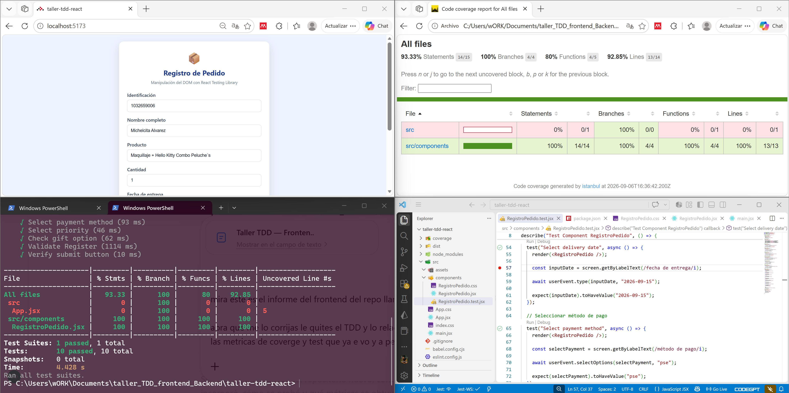
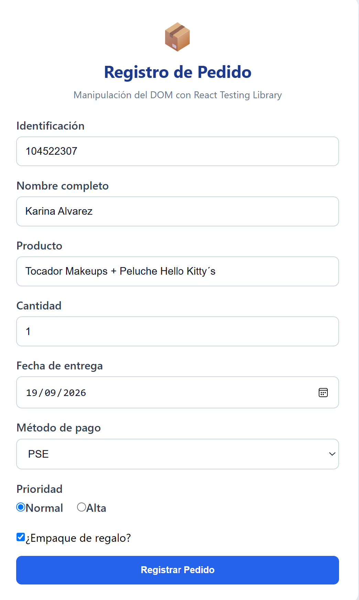
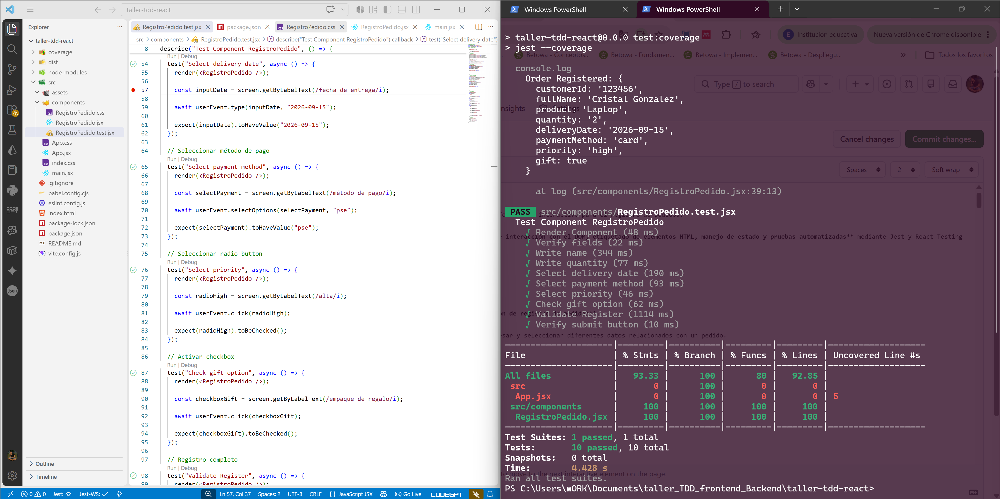

# Frontend React + Jest — Registro de Pedidos

Aplicación frontend desarrollada con **React** y **Vite** que implementa un formulario interactivo para el registro de pedidos.

El proyecto permite trabajar con **renderizado de componentes, manipulación e interacción con el DOM, etiquetado de elementos HTML, manejo de estado y pruebas automatizadas** mediante Jest y React Testing Library.

---

<p align="center">
  
</p>

<p align="center">
  
</p>

<p align="center">
  
</p>

<p align="center">
  
</p>

## 📌 Descripción

Este proyecto corresponde a la implementación del **frontend de una aplicación de registro de pedidos**.

La interfaz proporciona un formulario mediante el cual el usuario puede ingresar y seleccionar diferentes datos relacionados con un pedido.

Entre los campos utilizados se encuentran:

* Identificación del cliente.
* Nombre completo.
* Producto.
* Cantidad.
* Fecha de entrega.
* Método de pago.
* Prioridad.
* Opción de regalo.

El formulario administra los valores ingresados mediante el estado de React y permite comprobar el comportamiento de la interfaz mediante pruebas automatizadas.

Las pruebas verifican principalmente el **renderizado, presencia de campos, etiquetado, escritura de información, selección de opciones, interacción con controles y envío del formulario**.

---

## 🎯 Objetivos

### Objetivo general

Desarrollar una interfaz web en React para el registro de pedidos y verificar su correcto funcionamiento mediante pruebas automatizadas utilizando Jest y React Testing Library.

### Objetivos específicos

* Construir un formulario interactivo utilizando React.
* Administrar el estado de los campos mediante `useState`.
* Implementar diferentes tipos de controles HTML.
* Utilizar etiquetas asociadas correctamente con los elementos del formulario.
* Manipular y consultar el DOM mediante React Testing Library.
* Simular interacciones reales del usuario mediante `userEvent`.
* Ejecutar pruebas automatizadas mediante Jest.
* Utilizar JSDOM como entorno de pruebas.
* Utilizar Jest DOM para realizar aserciones sobre elementos HTML.
* Generar métricas de cobertura del código.
* Verificar la construcción del proyecto mediante Vite.

---

# 🏗️ Arquitectura del Frontend

La aplicación utiliza una estructura sencilla basada en componentes React.

```text
Taller-TDD-Frontend-React-Jest
│
├── src/
│   ├── components/
│   │   ├── RegistroPedido.jsx
│   │   ├── RegistroPedido.test.jsx
│   │   └── RegistroPedido.css
│   │
│   ├── App.jsx
│   └── main.jsx
│
├── babel.config.cjs
├── eslint.config.js
├── index.html
├── package.json
├── package-lock.json
├── vite.config.js
├── .gitignore
└── README.md
```

### Componentes principales

| Archivo                   | Responsabilidad                                 |
| ------------------------- | ----------------------------------------------- |
| `RegistroPedido.jsx`      | Componente principal del formulario de registro |
| `RegistroPedido.test.jsx` | Pruebas automatizadas del componente            |
| `RegistroPedido.css`      | Estilos visuales del formulario                 |
| `App.jsx`                 | Componente principal de la aplicación           |
| `main.jsx`                | Punto de entrada de React                       |
| `babel.config.cjs`        | Configuración de Babel para Jest y JSX          |
| `vite.config.js`          | Configuración del entorno Vite                  |

---

# ⚛️ Componente `RegistroPedido`

El componente principal se encuentra en:

```text
src/components/RegistroPedido.jsx
```

Este componente contiene la interfaz del formulario y administra las interacciones realizadas por el usuario.

El formulario utiliza el estado de React para almacenar temporalmente la información introducida en cada campo.

El manejo del estado permite que la interfaz se actualice dinámicamente cuando el usuario modifica cualquiera de los controles disponibles.

---

# 📝 Formulario de registro

El formulario utiliza diferentes tipos de elementos HTML para representar la información del pedido.

Entre los elementos utilizados se encuentran:

* Campos de texto.
* Campos numéricos.
* Campo de fecha.
* Selector de método de pago.
* Selector de prioridad.
* Casilla de selección para indicar si el pedido corresponde a un regalo.
* Botón de envío.

Esta variedad permite comprobar diferentes tipos de interacciones mediante las herramientas de testing utilizadas en el proyecto.

---

# 🏷️ Etiquetado de los elementos

Los elementos del formulario utilizan etiquetas HTML asociadas a sus respectivos controles.

Por ejemplo:

```jsx
<label htmlFor="fullName">
    Nombre completo
</label>

<input
    id="fullName"
    name="fullName"
/>
```

La asociación mediante `htmlFor` e `id` permite que React Testing Library pueda localizar los controles mediante sus etiquetas.

Por ejemplo:

```javascript
screen.getByLabelText(/nombre completo/i)
```

Este enfoque permite realizar pruebas desde una perspectiva cercana a la forma en que un usuario identifica los elementos de la interfaz.

---

# 🌐 Manipulación e interacción con el DOM

Las pruebas utilizan **React Testing Library** para renderizar el componente y consultar los elementos presentes en el DOM.

Para renderizar el componente:

```javascript
render(<RegistroPedido />)
```

Para localizar elementos mediante sus etiquetas:

```javascript
screen.getByLabelText(/nombre/i)
```

Para localizar el botón:

```javascript
screen.getByRole('button', {
    name: /registrar/i
})
```

Para escribir información:

```javascript
await user.type(input, 'Cristal Gonzalez')
```

Para seleccionar una opción:

```javascript
await user.selectOptions(select, 'card')
```

Para seleccionar una opción de prioridad:

```javascript
await user.selectOptions(select, 'high')
```

Para interactuar con una casilla:

```javascript
await user.click(checkbox)
```

Estas operaciones permiten comprobar que los elementos del formulario responden correctamente ante acciones realizadas por el usuario.

---

# 🧪 Estrategia de pruebas

Las pruebas automatizadas se encuentran en:

```text
src/components/RegistroPedido.test.jsx
```

Para las pruebas se utilizan las siguientes herramientas:

| Herramienta               | Función                                          |
| ------------------------- | ------------------------------------------------ |
| **Jest**                  | Ejecución de las pruebas automatizadas           |
| **React Testing Library** | Renderizado y consulta de componentes React      |
| **JSDOM**                 | Simulación del DOM dentro del entorno de pruebas |
| **userEvent**             | Simulación de interacciones del usuario          |
| **jest-dom**              | Matchers adicionales para elementos HTML         |
| **Babel**                 | Transformación de JSX para Jest                  |

El flujo general de las pruebas es:

```text
RegistroPedido.jsx
       ↓
     React
       ↓
     JSDOM
       ↓
React Testing Library
       ↓
   userEvent
       ↓
 Interacción
       ↓
   Assertions
       ↓
  PASS / FAIL
```

---

# 🧩 Jest DOM

El proyecto utiliza:

```text
@testing-library/jest-dom
```

Esta biblioteca proporciona matchers adicionales para realizar comprobaciones específicas sobre elementos del DOM.

Por ejemplo:

```javascript
expect(elemento).toBeInTheDocument()
```

Permite comprobar que un elemento se encuentra presente en el DOM.

También pueden utilizarse comprobaciones relacionadas con los valores de los controles:

```javascript
expect(input).toHaveValue('Cristal Gonzalez')
```

Esto permite verificar que las interacciones realizadas durante la prueba producen el resultado esperado.

---

# 🧪 Casos de prueba implementados

Actualmente se cuenta con **10 pruebas automatizadas**, todas aprobadas durante la última ejecución.

|  # | Prueba                | Objetivo                                               |
| -: | --------------------- | ------------------------------------------------------ |
|  1 | Render Component      | Verificar que el componente se renderice correctamente |
|  2 | Verify fields         | Comprobar la existencia de los campos del formulario   |
|  3 | Write name            | Verificar la escritura del nombre                      |
|  4 | Write quantity        | Verificar la escritura de la cantidad                  |
|  5 | Select delivery date  | Comprobar la selección de la fecha de entrega          |
|  6 | Select payment method | Comprobar la selección del método de pago              |
|  7 | Select priority       | Comprobar la selección de la prioridad                 |
|  8 | Check gift option     | Comprobar la selección de la opción de regalo          |
|  9 | Validate Register     | Verificar el envío y registro de la información        |
| 10 | Verify submit button  | Comprobar la existencia del botón de envío             |

---

# ⚙️ Configuración de Jest

La configuración principal de Jest se encuentra en:

```text
package.json
```

y:

```text
babel.config.cjs
```

El proyecto utiliza **JSDOM** como entorno de ejecución:

```text
jsdom
```

Esto permite ejecutar las pruebas de componentes React en un DOM simulado sin utilizar directamente un navegador.

La configuración de Babel permite que Jest procese archivos JSX:

```javascript
module.exports = {
    presets: [
        ['@babel/preset-env', { targets: { node: 'current' } }],
        ['@babel/preset-react', { runtime: 'automatic' }],
    ],
}
```

---

# 📦 Dependencias principales

### Dependencias de ejecución

```text
React
React DOM
```

### Dependencias de desarrollo

```text
Jest
Jest Environment JSDOM
React Testing Library
Testing Library DOM
Testing Library Jest DOM
Testing Library User Event
Babel
Babel Jest
Babel Preset Env
Babel Preset React
Vite
ESLint
```

Las versiones exactas pueden consultarse en:

```text
package.json
```

y:

```text
package-lock.json
```

---

# ▶️ Instalación

Clonar el repositorio:

```bash
git clone <URL_DEL_REPOSITORIO>
```

Ingresar al proyecto:

```bash
cd Taller-TDD-Frontend-React-Jest
```

Instalar las dependencias:

```bash
npm install
```

---

# 🚀 Ejecución del Frontend

Para iniciar el servidor de desarrollo:

```bash
npm run dev
```

Vite iniciará el entorno de desarrollo y proporcionará la dirección local para visualizar la aplicación en el navegador.

---

# 🧪 Ejecución de pruebas

Para ejecutar las pruebas:

```bash
npm test
```

### Resultado obtenido

```text
Test Suites: 1 passed, 1 total
Tests:       10 passed, 10 total
Snapshots:   0 total
Time:        4.056 s
```

Resultado:

```text
1 suite aprobada
10 pruebas aprobadas
0 pruebas fallidas
```

---

# 📊 Cobertura de código

Para generar el informe de cobertura:

```bash
npm run test:coverage
```

Resultado obtenido:

| Métrica    |   Cobertura |
| ---------- | ----------: |
| Statements | **93.33 %** |
| Branches   |   **100 %** |
| Functions  |    **80 %** |
| Lines      | **92.85 %** |

### Cobertura por componente

El componente `RegistroPedido.jsx` alcanzó:

| Métrica    | Cobertura |
| ---------- | --------: |
| Statements | **100 %** |
| Branches   | **100 %** |
| Functions  | **100 %** |
| Lines      | **100 %** |

La cobertura global es inferior debido a que `App.jsx` también forma parte de los archivos considerados por Jest.

### Interpretación

**Statements — 93.33 %**

Representa el porcentaje de instrucciones ejecutadas durante las pruebas.

**Branches — 100 %**

Indica que las ramas condicionales consideradas por Jest fueron recorridas durante las pruebas.

**Functions — 80 %**

Representa el porcentaje de funciones ejecutadas durante la suite de pruebas.

**Lines — 92.85 %**

Representa el porcentaje de líneas de código ejecutadas durante las pruebas.

Una cobertura elevada indica que una parte significativa del código fue ejercitada. Sin embargo, la cobertura no garantiza por sí misma la ausencia de errores; solamente indica qué parte del código fue ejecutada por las pruebas.

---

# 📄 Informe HTML de Coverage

Jest genera automáticamente el directorio:

```text
coverage/
```

El informe visual puede consultarse mediante:

```text
coverage/lcov-report/index.html
```

Este informe permite:

* Consultar los porcentajes de cobertura.
* Identificar los archivos analizados.
* Revisar las líneas ejecutadas.
* Identificar código no recorrido.
* Analizar las ramas cubiertas.

La carpeta `coverage/` debe mantenerse fuera del repositorio cuando corresponda, debido a que contiene resultados generados automáticamente.

---

# 🏗️ Verificación de compilación

El proyecto también puede construirse mediante Vite:

```bash
npm run build
```

Este proceso permite comprobar que los archivos React, JSX, CSS y demás recursos puedan procesarse correctamente para generar la aplicación de producción.

El proceso genera:

```text
dist/
```

Esta carpeta corresponde a archivos generados automáticamente.

---

# 🔄 Flujo general del proyecto

El funcionamiento general del frontend puede representarse de la siguiente manera:

```text
Usuario
   │
   ▼
Formulario React
   │
   ├── Datos del cliente
   ├── Información del producto
   ├── Cantidad
   ├── Fecha de entrega
   ├── Método de pago
   ├── Prioridad
   └── Opción de regalo
          │
          ▼
     Estado de React
          │
          ▼
     Envío del formulario
          │
          ▼
   Registro de información
```

Para las pruebas:

```text
Test
 │
 ▼
render()
 │
 ▼
JSDOM
 │
 ▼
DOM simulado
 │
 ▼
userEvent
 │
 ▼
Interacción
 │
 ▼
Assertion
 │
 ▼
PASS / FAIL
```

---

# 📋 Scripts disponibles

Los principales comandos definidos en `package.json` son:

| Comando                 | Función                                      |
| ----------------------- | -------------------------------------------- |
| `npm run dev`           | Ejecutar el frontend en modo desarrollo      |
| `npm run build`         | Construir la aplicación para producción      |
| `npm run preview`       | Previsualizar la construcción de producción  |
| `npm run lint`          | Analizar problemas de código mediante ESLint |
| `npm test`              | Ejecutar las pruebas de Jest                 |
| `npm run test:coverage` | Ejecutar pruebas y generar cobertura         |

---

# 🧹 Control de archivos

El proyecto utiliza `.gitignore` para evitar subir dependencias y archivos generados automáticamente.

Entre los principales elementos excluidos se encuentran:

```text
node_modules/
coverage/
dist/
.env
```

Los archivos principales del proyecto incluyen:

```text
src/
package.json
package-lock.json
babel.config.cjs
vite.config.js
eslint.config.js
index.html
README.md
```

Esto permite que otro desarrollador pueda clonar el repositorio e instalar nuevamente las dependencias mediante:

```bash
npm install
```

---

# 📈 Resultados de la ejecución

Los resultados obtenidos durante la última ejecución fueron:

```text
✅ 1 suite de pruebas aprobada
✅ 10 pruebas aprobadas
✅ 0 pruebas fallidas
✅ 100 % de cobertura de branches
✅ 93.33 % de statements
✅ 92.85 % de líneas
✅ 80 % de funciones
✅ RegistroPedido.jsx con 100 % de cobertura
```

Estos resultados evidencian que las pruebas cubren el renderizado del componente, la presencia de los campos, la escritura de información y las diferentes interacciones disponibles en el formulario.

---

# 📝 Conclusión

El desarrollo permitió construir y verificar una interfaz frontend interactiva utilizando **React**, incorporando diferentes tipos de controles HTML, manejo de estado y elementos correctamente etiquetados.

La funcionalidad fue evaluada mediante **Jest, React Testing Library, JSDOM, userEvent y Jest DOM**, permitiendo comprobar tanto el renderizado del componente como las principales interacciones realizadas por el usuario.

Durante la ejecución de la suite se obtuvo un resultado de **10 pruebas aprobadas de 10 ejecutadas**, con **0 pruebas fallidas** y una suite completamente aprobada.

El análisis de cobertura alcanzó un **93.33 % en statements, 100 % en branches, 80 % en functions y 92.85 % en lines**. De manera particular, el componente `RegistroPedido.jsx` obtuvo **100 % de cobertura en todas las métricas**, demostrando que sus instrucciones, ramas, funciones y líneas fueron ejercitadas por las pruebas implementadas.

En conjunto, los resultados permiten comprobar que el frontend cuenta con una base de pruebas automatizadas que verifica su comportamiento principal y proporciona métricas objetivas sobre el código ejecutado.

---

## 👨‍💻 Proyecto académico

**Proyecto:** Frontend React — Registro de Pedidos
**Tecnologías:** React · Jest · React Testing Library · JSDOM · Vite · Babel
**Lenguaje:** JavaScript / JSX
**Enfoque:** Pruebas automatizadas de componentes e interacción con el DOM
